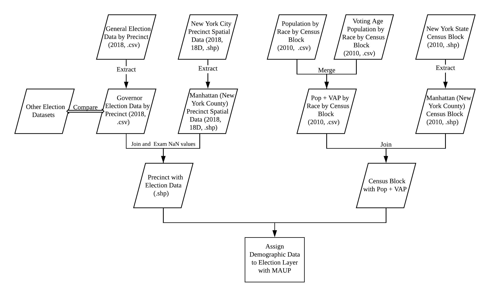

# Documentation
## Work Flow:

## Data Source:
- Election Districts (2018)
  - Downloaded election district and borough boundary shapefiles from [BYTES of the BIG APPLE](https://www1.nyc.gov/site/planning/data-maps/open-data/bytes-archive.page?sorts[year]=0&queries[search]=2018)
  - Administrative and Political Districts - Election Districts (Water Areas Included), 2018, 18D  
  - “Election District” and “Precinct” are used interchangeably throughout NYC data sources

  - Administrative and Political Districts - Borough Boundaries (Water Areas Included), 2018, 18D
  - We compared 2018 election district data from all 4 releases (18A, 18B, 18C, and 18D) and did not find noticeable differences, but chose 18D based on the assumption that the data was released quarterly, and 18D would refer to the fourth quarter (which includes November).

- Election data by precinct (2018)
  - Downloaded .csv file from OpenElections linked [Github](https://github.com/openelections/openelections-data-ny/blob/master/2018/20181106__ny__general__precinct.csv) and filtered out only New York county using python and excel
  - Confirmed 2018 **governor** results with   
    [NYS Board of Elections](https://www.elections.ny.gov/NYSBOE/elections/2018/general/2018Governor.pdf)  
    [New York Times](https://www.nytimes.com/elections/results/new-york-governor)

  - Confirmed 2018 **senator** results with   
    [NYSBOE](https://www.elections.ny.gov/NYSBOE/elections/2018/general/2018USSenate.pdf)  
    [New York Times](https://www.nytimes.com/interactive/2018/11/06/us/elections/results-new-york-elections.html)
  - Summation of votes from raw data matched reported data from above

- Census Block Data:
  - Shapefile, Population by Race, Voting Age Population by Race are downloaded 2010 Decennial Census from [NHGIS](https://www.nhgis.org)

## Data Handling:
  - Data Cleaning:  

  &nbsp;&nbsp;&nbsp;&nbsp;The raw Manhattan Gov. election data were reformatted into the appropriate form so that it could be joined onto the GIS data for part 2 after validating that it was accurate (changing column name, remove the unnecessary columns etc.).

- Missing precincts:  

  &nbsp;&nbsp;&nbsp;&nbsp;**64** precincts from the shapefile were not represented in the election dataset.   
  &nbsp;&nbsp;&nbsp;&nbsp;Some were assigned to be combined with other precincts according to vote.nyc’s election results summary, and were merged using QGIS. However, others were left blank. Most of the precincts missing from the election data were located in bodies of water/parks/roads/bridges/tunnels/etc., which we found by comparing the missing precincts with a basemap from Open Street Maps and logging in [this Google Sheet](https://docs.google.com/spreadsheets/d/1QlnM45cDy7lEPU2rtXuJWt25aU3TkOZMano96k7X67Q/edit?usp=sharing).

- Assign Census Block Data to Precincts:
  - Using package [MAUP](https://github.com/mggg/maup)  

- 1_election_data_cleaning
- 2_election_spatial_joins-1 & 2_election_spatial_joins-2
- 3_census_data_cleaning.ipynb
- 4_MAUP
- (Please see [this link](https://drive.google.com/drive/folders/14KDLq9Dbt1UazSl6jrx1pa4Dshv0FpUW?usp=sharing) for data&scripts)

- Made choropleth maps via ArcGIS
